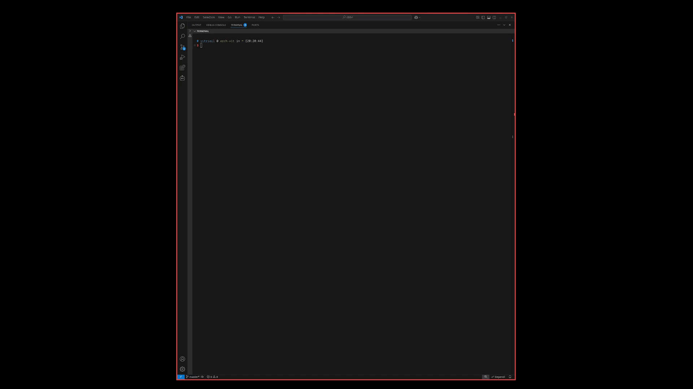

# ctrlrs

Enhanced Ctrl-R for shell history with n-dimensional search.

[](https://opensource.org/licenses/MIT)

## Features

- **N-dimensional search**: Press Ctrl-R once to filter by a first term, then press Ctrl-R again to add a second filter, and so on (up to 5 dimensions)
- **Auto-detection**: Automatically detects your shell (Bash, Zsh, Fish) and reads the appropriate history file
- **Real-time filtering**: See results update as you type
- **Easy navigation**: Use arrow keys to navigate through results
- **Cross-platform**: Works on Linux and macOS
- **Lightweight**: Fast and efficient with minimal dependencies

## Demo


## Installation

### Quick Install (Linux/macOS)

```bash
# Clone the repository
git clone https://github.com/vitrioil/ctrlrs.git
cd ctrlrs

# Run the install script
./scripts/install.sh
```

The install script will:
1. Build the binary from source
2. Install it to `~/.local/bin/`
3. Add shell integration to your shell configuration file
4. Make sure `~/.local/bin` is in your PATH

### Manual Installation

#### 1. Build from source

```bash
# Clone the repository
git clone https://github.com/vitrioil/ctrlrs.git
cd ctrlrs

# Build with Cargo
cargo build --release

# Copy the binary to a location in your PATH
cp target/release/ctrlrs ~/.local/bin/
chmod +x ~/.local/bin/ctrlrs
```

#### 2. Add shell integration

##### Bash

Add to your `~/.bashrc`:

```bash
# ctrlrs shell integration for Bash
function enhanced_ctrl_r() {
    # Use full path to ensure the command is found
    local ctrlrs_path="${HOME}/.local/bin/ctrlrs"
    if [ ! -x "${ctrlrs_path}" ]; then
        # Try to find ctrlrs in PATH as fallback
        ctrlrs_path=$(which ctrlrs 2>/dev/null)
    fi
    
    if [ -x "${ctrlrs_path}" ]; then
        # Create a temporary file to store the selected command
        local temp_file
        temp_file=$(mktemp)
        
        # Run ctrlrs with the output file option
        "${ctrlrs_path}" -o "$temp_file" </dev/tty >/dev/tty 2>/dev/null
        
        # Read the selected command from the temp file if it exists and has content
        if [ -f "$temp_file" ] && [ -s "$temp_file" ]; then
            local result
            result=$(cat "$temp_file")
            
            # Update the command line with the selected command
            READLINE_LINE="$result"
            READLINE_POINT=${#READLINE_LINE}
        fi
        
        # Delete the temp file
        rm -f "$temp_file"
    else
        echo "ctrlrs not found. Please make sure it's installed." >/dev/tty
    fi
}

# Override Ctrl+R with our enhanced version
bind -x '"\C-r": enhanced_ctrl_r'
```

##### Zsh

Add to your `~/.zshrc`:

```zsh
# ctrlrs shell integration for Zsh
function enhanced_ctrl_r() {
    local ctrlrs_path="${HOME}/.local/bin/ctrlrs"
    if [ ! -x "${ctrlrs_path}" ]; then
        ctrlrs_path=$(which ctrlrs 2>/dev/null)
    fi

    if [ -x "${ctrlrs_path}" ]; then
        # Ensure proper terminal behavior
        zle -I
        zle reset-prompt

        # Create a temporary file to store the selected command
        local temp_file
        temp_file=$(mktemp)
        
        # Run ctrlrs with the output file option
        "$ctrlrs_path" -o "$temp_file" </dev/tty >/dev/tty 2>/dev/null
        
        # Read the selected command from the temp file if it exists and has content
        if [ -f "$temp_file" ] && [ -s "$temp_file" ]; then
            local result
            result=$(cat "$temp_file")
            
            # Set the command buffer if a result was selected
            BUFFER="$result"
            CURSOR=${#BUFFER}
        fi
        
        # Delete the temp file
        rm -f "$temp_file"

        # Refresh prompt
        zle reset-prompt
    else
        echo "ctrlrs not found. Please make sure it's installed." >/dev/tty
        zle reset-prompt
    fi
}

# Bind the function to Ctrl+R
zle -N enhanced_ctrl_r
bindkey '^R' enhanced_ctrl_r
```

##### Zsh on macOS

For macOS users with Zsh, add to your `~/.zshrc`:

```zsh
# ctrlrs shell integration for ZSH on macOS
# Function to find the ctrlrs executable
function _find_ctrlrs() {
    local ctrlrs_path="${HOME}/.local/bin/ctrlrs"
    if [ ! -x "${ctrlrs_path}" ]; then
        ctrlrs_path=$(which ctrlrs 2>/dev/null)
    fi
    echo "$ctrlrs_path"
}

# Function to be used as a regular command
function r() {
    local ctrlrs_path=$(_find_ctrlrs)
    
    if [ ! -x "${ctrlrs_path}" ]; then
        echo "ctrlrs not found. Please make sure it's installed."
        return 1
    fi
    
    # Create a temporary file to store the selected command
    local temp_file
    temp_file=$(mktemp "/tmp/ctrlrs.XXXXXX") || return
    
    # Run ctrlrs with the output file option
    "${ctrlrs_path}" -o "$temp_file"
    
    # Read the selected command from the temp file if it exists and has content
    if [ -f "$temp_file" ] && [ -s "$temp_file" ]; then
        local result
        result=$(cat "$temp_file")
        
        # Print the command to the terminal
        print -z "$result"
    fi
    
    # Delete the temp file
    rm -f "$temp_file"
}
```

This macOS-specific integration uses the `r` command instead of `Ctrl+R` binding, as there are issues with terminal I/O handling on macOS that prevent the Ctrl+R binding from working reliably. Simply type `r` and press Enter to launch the search interface.

##### Fish

Add to your `~/.config/fish/config.fish`:

```fish
# ctrlrs shell integration for Fish
function fish_user_key_bindings
    # Use full path to ensure the command is found
    set ctrlrs_path "$HOME/.local/bin/ctrlrs"
    if not test -x "$ctrlrs_path"
        # Try to find ctrlrs in PATH as fallback
        set ctrlrs_path (which ctrlrs 2>/dev/null)
    end
    
    if test -x "$ctrlrs_path"
        # Define a function to handle Ctrl+R
        function _enhanced_ctrl_r
            # Create a temporary file to store the selected command
            set -l temp_file (mktemp)
            
            # Run ctrlrs with the output file option
            $ctrlrs_path -o $temp_file </dev/tty >/dev/tty 2>/dev/null
            
            # Read the selected command from the temp file if it exists and has content
            if test -f "$temp_file" -a -s "$temp_file"
                set -l result (cat "$temp_file")
                
                # Set the command line to the selected command
                commandline -r $result
                commandline -f repaint
            end
            
            # Delete the temp file
            rm -f "$temp_file"
        end
        
        # Override Ctrl+R with our enhanced version
        bind \cr _enhanced_ctrl_r
    else
        echo "ctrlrs not found. Please make sure it's installed." >/dev/tty
    end
end
```

## Usage

### For most users (Linux and macOS with Bash/Fish)

1. Press `Ctrl+R` in your terminal to activate the enhanced history search
2. Type your first search term to filter commands
3. Navigate through results with `Up/Down` arrow keys
4. Press `Ctrl+R` again to enter a second search term for nested filtering
5. Continue pressing `Ctrl+R` to add more filters (up to 5 dimensions)
6. Press `Enter` to select a command or `Esc` to cancel

### For macOS users with ZSH

Due to terminal I/O handling issues on macOS with ZSH, the `r` command is used instead of `Ctrl+R`:

1. Type `r` and press `Enter` in your terminal to activate the enhanced history search
2. Type your first search term to filter commands
3. Navigate through results with `Up/Down` arrow keys
4. Press `Ctrl+R` to enter a second search term for nested filtering
5. Continue pressing `Ctrl+R` to add more filters (up to 5 dimensions)
6. Press `Enter` to select a command or `Esc` to cancel

## Configuration

`ctrlrs` works out of the box with no configuration, but you can customize its behavior with command-line options:

```
USAGE:
    ctrlrs [OPTIONS]

OPTIONS:
    -d, --debug                 Enable debug logging
    -s, --shell <SHELL>         Specify shell type (auto-detected if not specified)
    -f, --history-file <PATH>   Specify history file path (auto-detected if not specified)
    -o, --output-file <PATH>    Specify output file path for the selected command
    -h, --help                  Print help information
    -V, --version               Print version information
```

## Uninstallation

```bash
# Run the uninstall script
./scripts/uninstall.sh
```

Or manually:
1. Remove the binary: `rm ~/.local/bin/ctrlrs`
2. Remove the shell integration from your shell configuration file

## Development

### Prerequisites

- Rust 1.56.0 or later
- Cargo

### Building

```bash
cargo build
```

### Running Tests

```bash
cargo test
```

### Running Locally

```bash
cargo run
```

## Contributing

Contributions are welcome! Please feel free to submit a Pull Request.

1. Fork the repository
2. Create your feature branch (`git checkout -b feature/amazing-feature`)
3. Commit your changes (`git commit -m 'Add some amazing feature'`)
4. Push to the branch (`git push origin feature/amazing-feature`)
5. Open a Pull Request

## License

This project is licensed under the MIT License - see the [LICENSE](LICENSE) file for details.
